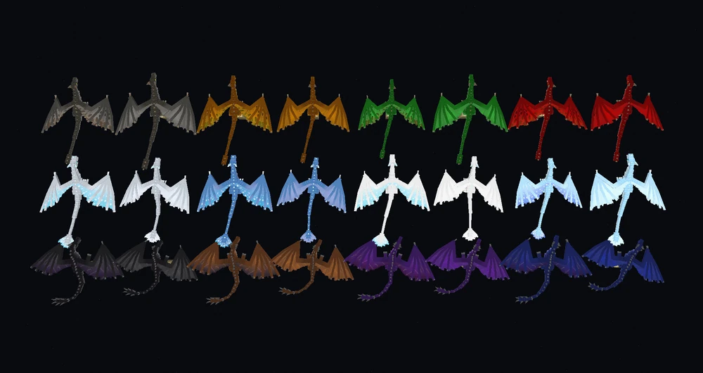
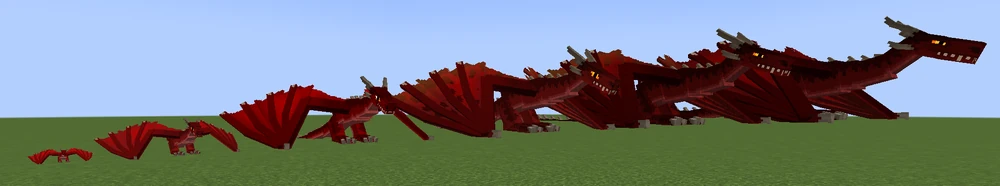

# Dragons

Dragons are the main mobs in Ice and Fire.
They have different stages, colors, elements, gender and abilities.

## Elements and colors
Dragons are divided into elements: fire, ice and lightning. Each element has 4 color variations. Male dragons have patterns on their wings(left ones on the image), female dragons have curvier horns.

*Image from the original IaF wiki([link](https://ice-and-fire-mod.fandom.com/wiki/File:All_dragon_colors.png))

### Fire Dragons
Fire Dragons breathe fire, are immune to lava and fire. They spawn in almost every biome(temperature >-0,5).
Colors: (first row on image)
* Gray
* Bronze
* Emerald
* Red

### Ice Dragons
Ice Dragons breathe ice, leaving spikes and freezeing mobs. Unlike fire and lightning, they can swim. They spawn in cold biomes(temperature <=-0,5).
Colors: (second row on image)
* Silver White
* Gem Blue
* Snowy White
* Icy Blue

### Lightning Dragons
Lightning Dragons breathe powerful lightning. They spawn in Jungle, Savanna, and Badlands biomes.

Colors: (third row on image)
* Dark Black
* Copper Brown
* Amethyst Purple
* Electric Blue

## Stages
All dragons are divided into 5 stages of growth. 
*Image from the original IaF wiki([link](https://static.wikia.nocookie.net/ice-and-fire-mod/images/6/69/2025-07-03_22.28.34.png/revision/latest?cb=20250704015507))

Stage 1: 20-112 hp
Stage 2: 116-208 hp
Stage 3: 212-304 hp
Stage 4: 308-400 hp
Stage 5: 404-500 hp

Stage 4 and 5 dragons spawn only in underground caves. Female stage 4 and 5 dragons drop dragon eggs, which allow you to hatch your own dragon,